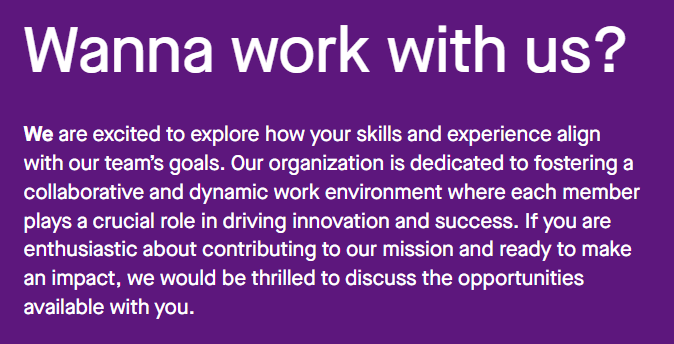
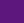

 Component: ***Wanna work with us?***
# Type: **Intro**  
 
 ## Templates:  
 Template *Menu* appears after selecting Type
 ***  
### *B/W Text Left-Top*  
  * Title                
  * Content
  * Background Media      
  * Background Color  
   

### *B/W Text Left-Bottom*
  * Title
  * Content
  * Background Media
  * Background Color
***
### IMAGE  
  

### DESCRIPTION 
 1) ***Title***  ~> Wannna work with us?   
 2) ***Content*** ~> We are excited to ..................................... availible with you.  
 3) ***Background Media***   
 4) ***Background Color*** #5D177D   
   

:::note

The Formating is same
* The First Template shows content on Top of Header
* The Second on the Bottom of Header  
:::

 
