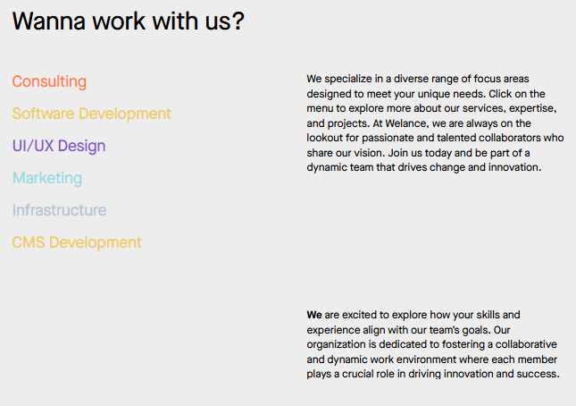
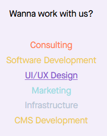
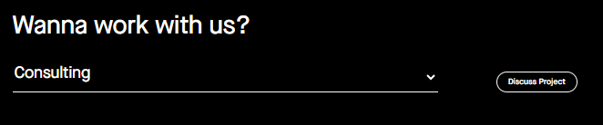
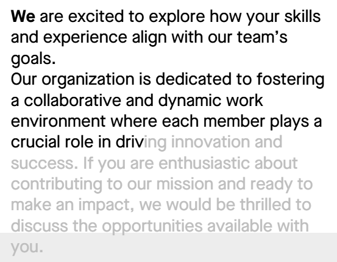
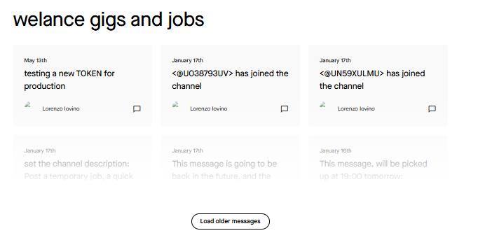

 Component: ***Wanna work with us?***
# Type: **Lists/Slides/Tabs**  
 
 ## Templates:  
 Template *Menu* appears after selecting Type
 ***  
### *Slides, Timeline Dark*  
  * Title Tab                
  * Title
  * Content    
  * Background Media  
   

### *People w/GPS*
  * Title
  * Content
  * Includes (People/Users)

### *Department's Big - Left Aligned*
  * Title
  * Content
  * Includes (People/Users)  

  

### *Department's Small - Centre Aligned*
  * Title
  * Content
  * Includes (People/Users)    

  

### *Department Dropdown + CTA*
  * Title
  * Content
  * Includes (People/Users)
  * Ct As (Items)  

### *Welance ScrollyTelly Animation*
  * Content
  * Media    

  

### *Welance Job Chat*
  * Title
  * Content    
  
  
  
***

   

:::note

This component is partially (or entirely) static. It might NOT require includes, and to modify it entirly, yoy might need to reach out to tech.  
:::

 
