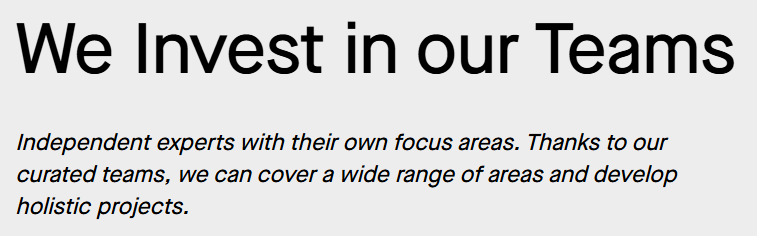

Component: ***Welance Scrolly Telling***
# Type: **Intro**  

## Templates:  
 Template *Menu* appears after selecting Type
 ***  
 ### *B/W Text Left-Top*  
  * Title                
  * Content
  * Background Media      
  * Background Color 
     

### *B/W Text Left-Bottom*
  * Title
  * Content
  * Background Media
  * Background Color
***
### IMAGE  
 

### DESCRIPTION 
 1) ***Title***  ~> We Invest in our Teams  
 2) ***Content*** ~> Independent experts with ..................................... areas and develop holistic projects.
 3) ***Background Media*** ~> None 
 4) ***Background Color*** ~> None  

 :::note

The Formating is same for both *Templates*
* The First Template shows content on **Top** of Header
* The Second on the **Bottom** of Header  
:::